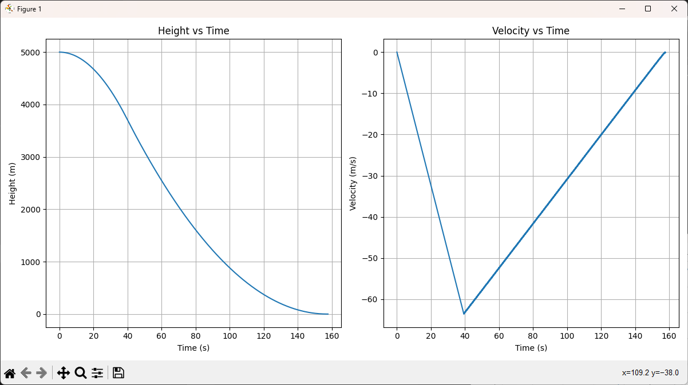
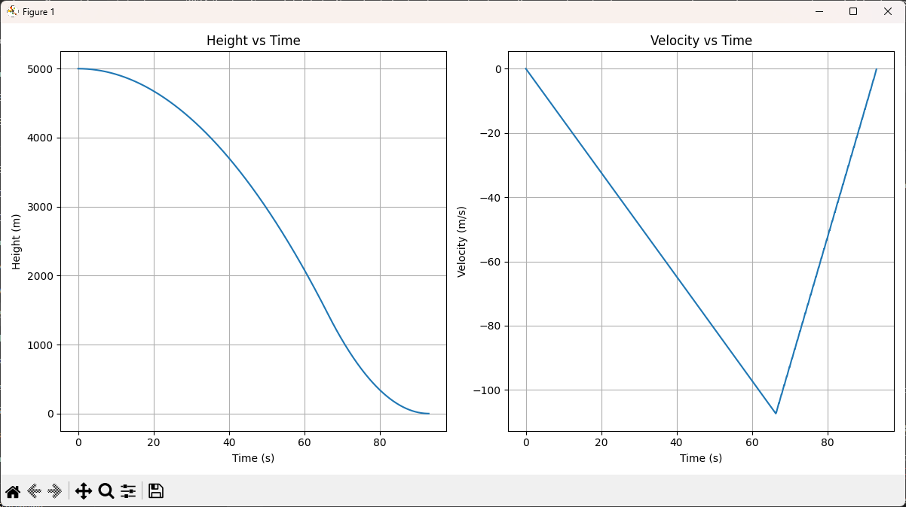
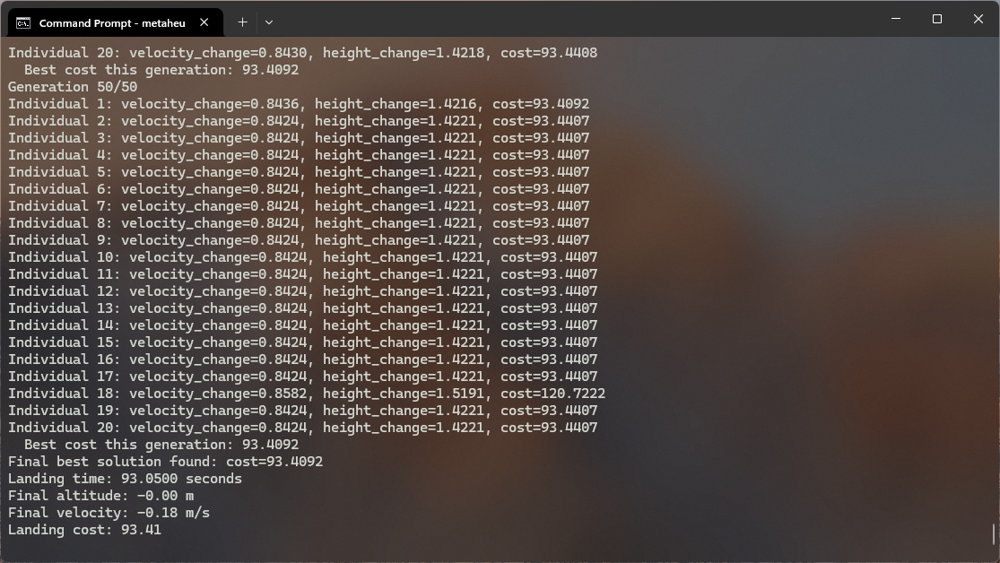
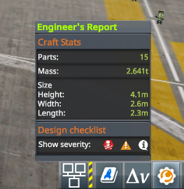
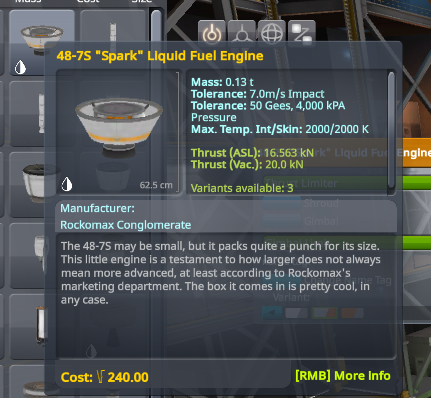
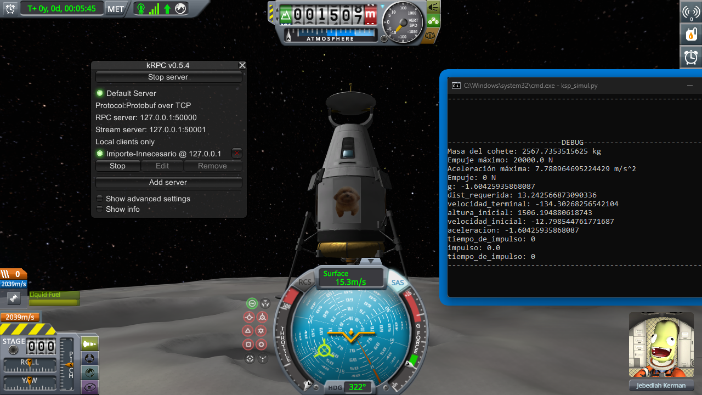

<h1 align="center">Simple Rocket Landing Optimization</h1>

## Authors

* **Elizabeth Huang Wu**
* **Esteban Isaac Baires Cerdas**

## Description of the problem

Given a small rocketship with thrust ($F$) and ($h$) meters above the ground, find the best possible maneuver such that the time to land ($t$) is as small as possible, without going over the maximum amount of force ($I$) the rocket can tolerate upon impact.

To simplify the problem, and also due to time constraints, the problem has been reduced to **only 1 axis**. Where the rocket can only travel upwards, away from the ground, or down to it's landing site.

## Solutions

In total, 3 techniques have been used to find either optimal or the best solutions to a given landing scenario:

1. [Brute Force](src/bruteforce.py)
2. [Heuristic](src/heuristic.py)
3. [Metaheristic](src/metaheuristic.py)

## Simulation

To demonstrate the results of finding an optimal maneuver, the landing algorithm used in the *brute force* and *heuristic* solutions has been modified to run at real time inside the space flight simulation game Kerbal Space Program:

* [Simulation](src/ksp_simul.py)

The maneuver can be modified with several parameters like:

* **Time Skip Length**: Dictates the amount of time taken between steps of the maneuver.
* **Velocity ROC**: Rate of change at which the rocket's downwards speed is reduced
* **Extra Altitude**: Increases the altitude at which a step in the maneuver is to be performed  

## Usage manual

At the repo's directory:

1. Run a solution algorithm

``` bash
$ python3 (fuerzabruta.py|heuristica.py|metaheuristica.py)
```

Any of the solutions will show a graph on the screen representing the speed over time of the trajectory followed by the rocket.

For the following examples, these parameters were used:

```python
    initial_height = 5000
    initial_velocity = 0
    rocket_mass = 2641
    max_thrust = 20000
    dt = 0.05
````

* Output of the [Brute Force](src/bruteforce.py) method:


* Output of the [Heuristic](src/heuristic.py) method:


* Output of the [Metaheuristic](src/metaheuristic.py) method:


The final parameters of the maneuver will also be printed in the console:


You can check the weight of a vessel in game by clicking in the "Engineer's Report" tab in the bottom right corner of the screen:



The maximum thrust of a rocket engine can be found by hovering the mouse over the engine in the VAB (Vehicle Assembly Building) or SPH (Space Plane Hangar):


In this case case the rocket's mass is 2641 kg and the maximum thrust of the engine is 20000 N

## Usage manual for ksp_simul.py

To execute this program you need:

* An installed copy of the spaceflight simulation game [Kerbal Space Program](https://es.wikipedia.org/wiki/Kerbal_Space_Program) (version 12.5 for Windows)
* The [server plugin](https://krpc.github.io/krpc/getting-started.html#the-server-plugin) and [python client](https://krpc.github.io/krpc/getting-started.html#the-python-client) for [kRPC](https://krpc.github.io/krpc/index.html)

```bash
pip install krpc
```

After verifying all the previous requirements are met, start KSP and get into a "desirable" landing trajectory, that is, one where the rocket's velocity along the x and z axis has been reduced to as close to 0 as possible, then start the kRPC server an run the program with:

```bash
python ksp_simul.py
```

An automatic landing will be attempted with the current active ship. **Click the image or [here](https://youtu.be/8dky9rphE80)** to see a video demo of the automatic landing.**

[](https://youtu.be/8dky9rphE80)
